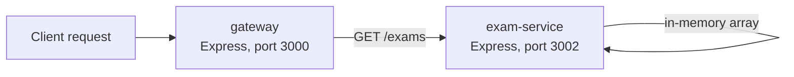

# Microservices demonstration (preserved coursework)

This folder is a self-contained microservices demonstration built earlier in the course. It is **not** part of the ExamApp runtime described in the root [`README.md`](../README.md) — ExamApp's client, API, and database run entirely outside this folder, and nothing here is required to run, test, or deploy ExamApp.

It is preserved to demonstrate the microservices pattern as an additional technical concept, separate from ExamApp's own layered-monolith API.

## What it contains



- **`gateway/`** — a minimal Express service that exposes `/api/exams` and proxies it to the exam service via `fetch`, plus its own `/health` endpoint. Demonstrates the API-gateway pattern: a single public entry point routing to an internal service.
- **`exam-service/`** — a minimal Express service that serves a small in-memory array of sample exams from `GET /exams`, plus its own `/health` endpoint. Represents a bounded, independently deployable service.
- **`compose.yaml`** — Docker Compose configuration that builds and runs both services together, with the gateway configured to reach the exam service via `EXAM_SERVICE_URL`.

## Running it (optional, standalone)

```powershell
cd microservices
docker compose up --build
```

Then `GET http://localhost:3000/api/exams` returns the exam-service's sample data via the gateway, and `GET http://localhost:3000/health` / `GET http://localhost:3002/health` confirm each service independently.

## Relationship to ExamApp

| | ExamApp (root `server/`) | This module |
| --- | --- | --- |
| Architecture | Layered monolith (routes → controllers → services → repositories) | Two independent services behind a gateway |
| Data | PostgreSQL (Neon), persistent | In-memory array, resets on restart |
| Purpose | The graded application | Demonstrates the microservices pattern as an additional technical concept |

No ExamApp route, service, or client code imports from or depends on anything in this folder.
